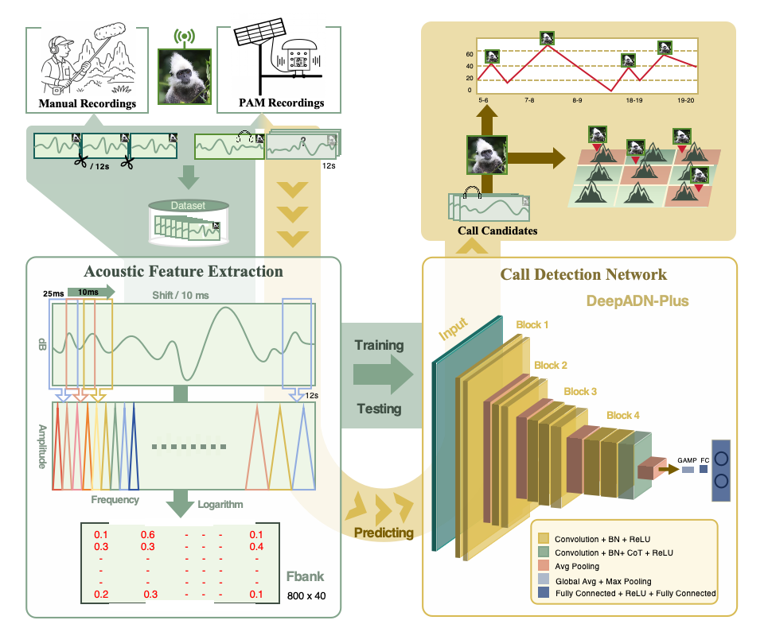

# DeepADN-PLUS
This project builds a deep learning pipeline based DeepADN-PLUS model to detect the calls of adult male white headed langurs in audio files recorded by automatic recording units, and ultimately find the audio containing the target call among many recordings.



# Initialization

## Setup

Clone the repository and navigate to the project directory:

```bash
git clone https://github.com/yhzdsk/DeepADN-PLUS.git
cd xxx
```

## Dependencies

Our implementation is based on [PyTorch](https://pytorch.org). We recommend using `conda` to create the environment and install dependencies.Select the appropriate `cudatoolkit` version according to your system:

```
conda create --name XXX python=3.8
conda activate XXX
conda install conda install pytorch==1.13.1 torchvision==0.14.1 torchaudio==0.13.1 pytorch-cuda=11.6 -c pytorch -c nvidia
pip install -r requirements.txt
```

## Prepare the data

Generate a data list for the next step, with `audio_path` as the audio file path. Users need to store the audio dataset in the `dataset/audio` directory in advance, with each folder containing a category of audio data. Each audio data should be at least 3 seconds long, such as` dataset/audio/bird calls/···`. `Audio `is the location where the data list is stored, and the format of the generated data category is` Audio Path \ t Audio Corresponding Category Label`. The audio path and label are separated by a tab `\ t`. Readers can also modify the following functions according to their own way of storing data.

Taking `audio.zip` as an example, this is a dataset of wild white headed langur calls created by our research team, which includes two categories: positive calls from adult male white headed langurs and negative sounds without white headed langur calls. The following is a function for generating a data list for this dataset. If readers want to use this dataset, please download and extract it to the `dataset` directory, and change the code for generating the data list to the following code.
Run `create_data_list.py` to generate the data list, which provides various methods for creating datasets. For details, refer to the code.
```
python create_data_list.py
```
After running create_data_list.py, we obtain train.txt and test.txt. The dataset structure is as follows:
```
./datasets
├── [dataset_name]
│   └── train
│       ├── positive
│       │   ├── xxx.mp3
│       │   └── xxxx.mp3
│       └── negative
│           └── ...
│   └── test
│       ├── positive
│       │   └── ...
│       └── negative
│           └── ...
```

## Training model
First, specify the paths of the training set and test set in `config.yml`, then modify the specific parameters, and finally run `train.py`.

The `train_list` and `test_list` in `config.yml` are used to select the txt files generated in the previous step，Select any one of MelSpectrogram, MFCC, or Fbank as the `feature_method`.Please adjust the settings in `config.yml` based on the audio length, sampling rate, and other information in the yourself-made dataset.

Below are the meanings of the parameters in `train.py`
```
add_arg('configs',          str,    '/path/to/configs.yml',    'Configuration file'    )
add_arg("local_rank",       int,    0,                       'Parameters required for multi-card training'   )
add_arg("use_gpu",          bool,   True,                  'Whether to use GPU for training'    )
add_arg('save_model_path',  str,    '/path/to/model/',           'Path for model saving'   )
add_arg('resume_model',     str,    None,                    'Resume training. If None, do not use pre-trained model'   )
add_arg('pretrained_model', str,    None,                 'The path of the pre-trained model. If it is None, the pre-trained model will not be used'  )
```
After adjusting the aforementioned parameters and paths, you can proceed with training the model
```
CUDA_VISIBLE_DEVICES=0 python train.py
```
## Applying model 
`infersound.py` is used for batch prediction of audio file categories and automatically categorizes them into different folders based on the prediction results. It performs inference based on DeepADN-PLUS and is suitable for organizing messy audio data into a directory structure of "category name/filename".

Core function: Traverse all audio files in the specified audio directory (including subfolders), use a trained model to predict the category of each audio, automatically create subfolders named after the category in the output directory, and move the audio files to the corresponding category folders.
Example of processed directory structure:
```
output directory/
├── positive
│   ├── audio1.mp3
│   └── audio2.mp3
├── negaitve
│ └── audio3.mp3
│ └── audio3.mp3
```
Parameter Description:
```
add_arg('configs',          str,    'XXXX',   'Configuration file')
add_arg('use_gpu',          bool,   True,                  'Whether to use GPU for prediction')
add_arg('audio_dir',        str,    "XXXX", 'Audio folder path')
add_arg('model_path',        str, 'XXXX', 'The file path of the trained prediction model')
add_arg('output_dir',       str,     "XXXX", 'output folder path')
```
After adjusting the aforementioned parameters, run 
```
python classify.py
```
